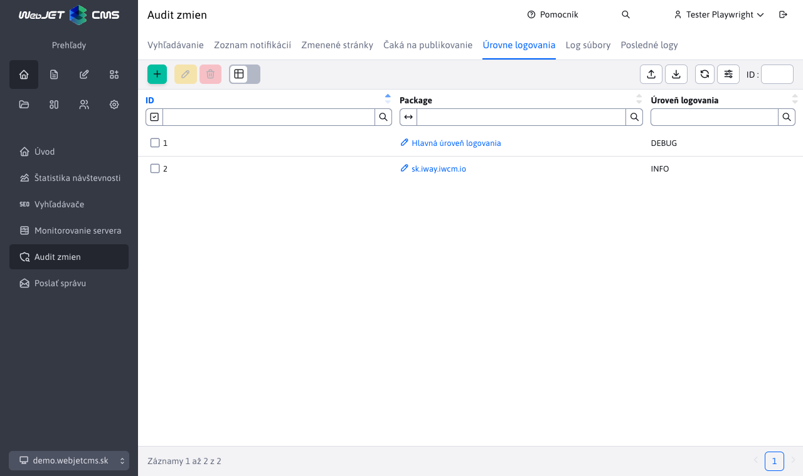
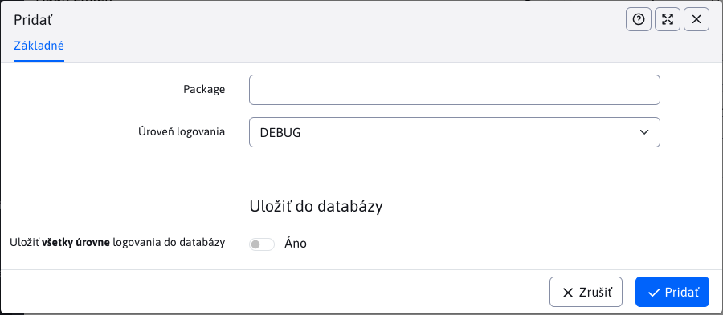

# Úrovne logovania

Aplikácia Úrovne logovania umožňuje spravovanie úrovni logovania pre jednotlivé java balíky.



Prvý záznam v tabuľke je vždy **Hlavná úroveň logovania** (základná úroveň).

Využívajú sa 2 konfiguračné premenné:

- **logLevel**, obsahuje hodnotu úrovne logovania pre **Hlavná úroveň logovania**
- **logLevels**, obsahuje zoznam java balíkov s úrovňou logovania (každý na novom riadku). Napr.:

```
sk.iway=DEBUG
sk.iway.iwcm=WARN
org.springframework=WARN
```

Zmeny nad tabuľkou sú uchovávané lokálne v konštante. Ak zmeny (nastavenia) chcete uložiť permanentne, v editore je potrebné zvoliť možnosť **Uložiť do databázy**. Pri uložení sa aktualizujú spomínané konfiguračné premenné v databáze.

# Pridanie

Pri akcií pridania je potrebná hodnota java balíka (package) a úrovne logovania. Ak zadáte už pridaný package, nevytvorí sa duplicitná hodnota ale aktualizuje sa už existujúca.



# Editácia

Akcia editácie sa správa rozdielne pre Hlavnú úroveň logovania a ostatné logovania.

## Hlavná úroveň logovania

Pri editácii hlavnej úrovne môžeme zvoliť iba logovania typu NORMAL alebo DEBUG (pre podrobné logovanie). Ak v editore zmeníte hodnotu `Package`, žiadna zmena sa nevykoná. Nakoľko hlavná úroveň musí byť stále prítomná, zmeniť sa dá iba hodnota úrovne logovania.

## Ostatné logovania

Zmena úrovne logovania sa uloží, ak zmeníte package, pôvodné logovanie zmizne a bude nahradené týmto novým. Povolené sú všetky úrovne logovania okrem hodnoty NORMAL.

# Mazanie

Všetky packages s úrovňou logovania sa dajú vymazať okrem **Hlavnej úrovne logovania**. Pri pokuse o vymazanie sa nič s ňou nestane (ani hodnota sa nezmení).