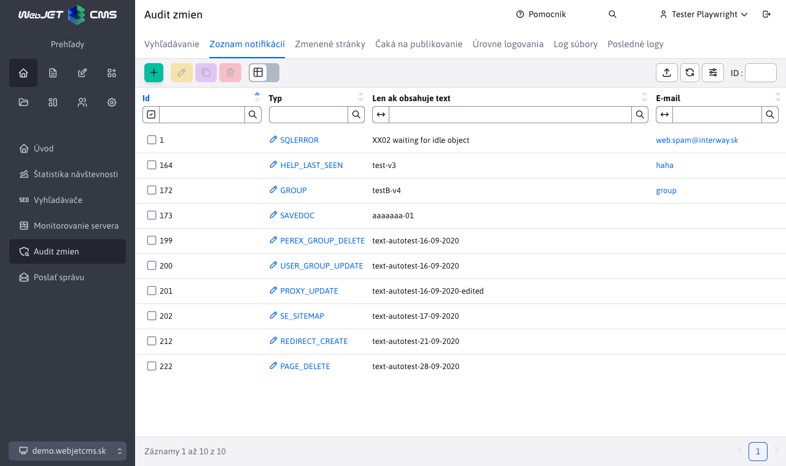
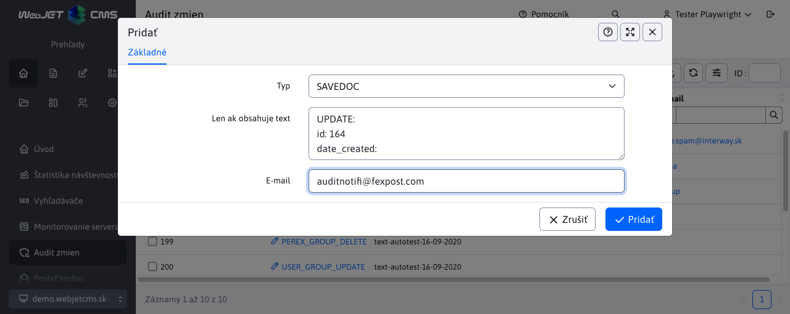

# Zoznam notifikácií

V menu položke Zoznam notifikácií je možné nastaviť email notifikácie pri určitých udalostiach / chybách systému. Odporúčame nastaviť notifikáciu pre udalosti typu `XSS` a `SQLERROR`.

V editore je možné nastaviť aj doplnkový text, ktorý chyba musí obsahovať, aby bola odoslaná na zadaný email.

Ako email odosielateľa sa použije email príjemcu. V prípade potreby je možné nastaviť meno a email odosielateľa všetkých emailov notifikácií auditu pomocou konfiguračných premenných `auditDefaultSenderName` a `auditDefaultSenderEmail`.