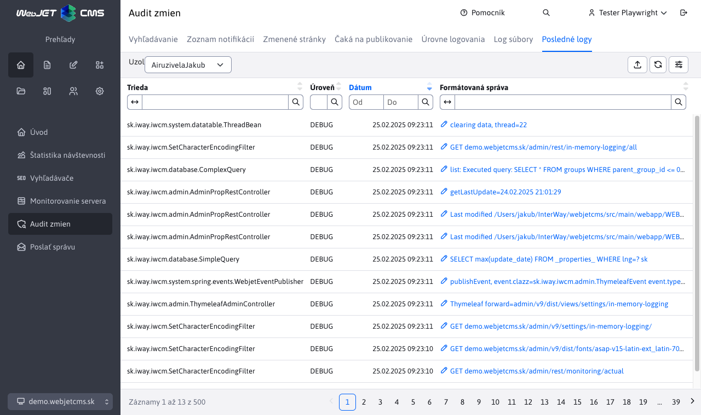

# Posledné logy

Aplikácia je určená na zobrazenie posledných logov, v prípade, že nemáte prístup k logom na súborovom systéme. Zobrazuje logy, ktoré prechádzajú cez log framework (čiže používajú triedu ```Logger```), nezobrazí logy zapísané priamo cez ```System.out``` alebo ```System.err```.



Podporuje cluster, je tak možné vyžiadať aj posledné logy z iného uzla clustra. V karte ```Stack Trace``` sa nachádza výpis zásobníka (obsah sa ale zobrazí len pre chybové záznamy, pre štandardné log úrovne je prázdny).

## Konfiguračné možnosti/nastavenia:

- ```loggingInMemoryEnabled``` - nastavením na ```true/false``` povolíte alebo zakážete ukladanie logov do pamäte.
- ```loggingInMemoryQueueSize``` - maximálny počet logov zapísaných do pamäte (predvolene 200). Upozorňujeme, že všetky dáta sa naraz načítajú do tabuľky a z dôvodu prenosu ```stack trace``` môžu byť veľké. Neodporúčame túto premennú nastavovať na extrémne vysokú hodnotu.

Pre správne fungovanie musí byť ```logger``` nastavený aj v súbore ```logback.xml```. Predvolene je takto nastavený, ak ste ale súbor menili, je potrebné doplniť ```IN_MEMORY appender``` a pridať jeho volanie pre ```root``` element.

```xml
    ...
    <appender name="IN_MEMORY" class="sk.iway.iwcm.system.logging.InMemoryLoggerAppender" />

    <root level="ERROR">
        <appender-ref ref="STDOUT" />
        <appender-ref ref="IN_MEMORY" />
    </root>
    ...
```

## Implementačné detaily

- ```sk.iway.iwcm.system.logging.InMemoryLoggerAppender``` - ```appender``` pre ```logback```, ktorý zabezpečuje odoslanie logov do ```InMemoryLoggingDB```
- ```sk.iway.iwcm.system.logging.InMemoryLoggingDB``` - trieda zabezpečuje zápis a získanie logov z a do ```queue```, načítanie logov na clustri
- ```sk.iway.iwcm.system.logging.InMemoryLoggingEvent``` - model pre log event
- ```sk.iway.iwcm.system.logging.InMemoryLoggerRestController``` - controller pre výpis logov do DataTable
