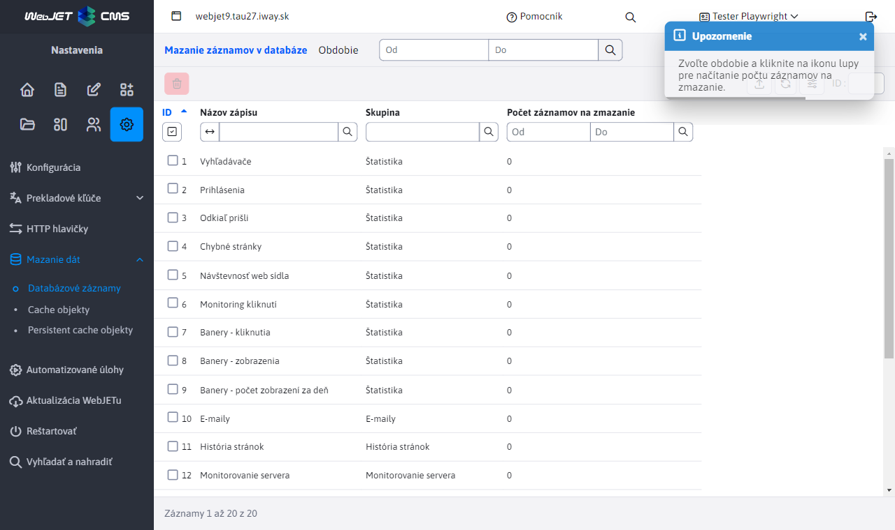
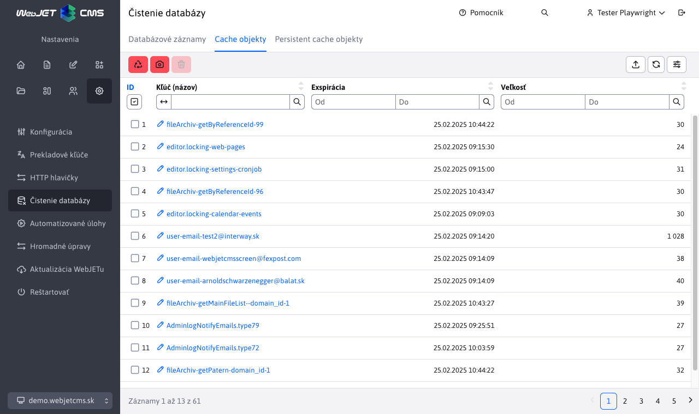
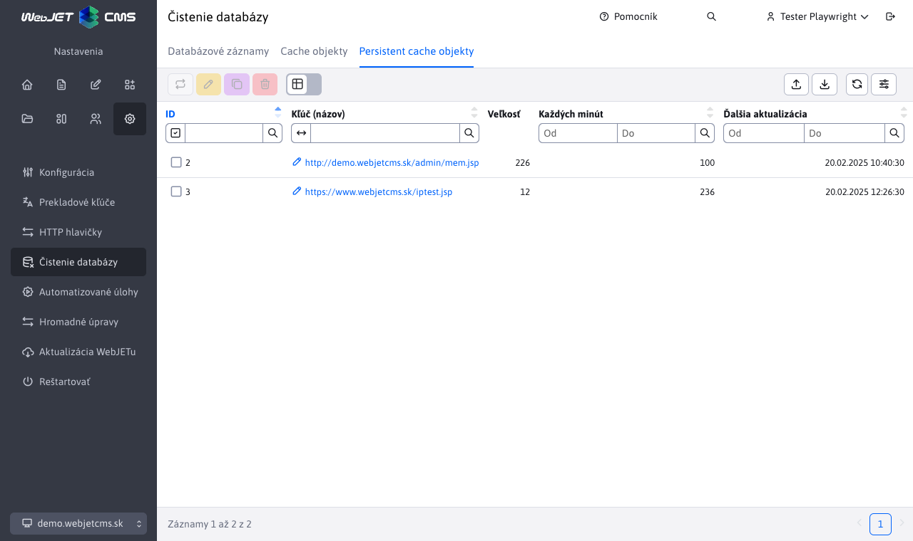

# Mazanie dát

Aplikácia **Mazanie dát** vám umožňuje odstrániť nepotrebné dáta z databázy, čím môžete zvýšiť výkon servera a uvoľniť miesto na disku.
Tento nástroj nájdete v sekcii **Nastavenia** pod položkou **Mazanie dát**.

## Databázové záznamy

Mazanie dát z vybraných databázových tabuliek, mazanie je možné z nasledovných skupín:

- **Štatistika**: Odstraňuje štatistické dáta. Zmazanie starších dát môže významne zlepšiť výkon servera, stratíte ale informácie o návštevnosti webu za zvolené obdobie.
- **E-maily**: Umožňuje odstrániť odoslané e-maily z aplikácie Hromadný e-mail a emaily odoslané s časovým oneskorením (prípadne emaily odoslané vrámci viac uzlového clustra).
- **História stránok**: Maže zaznamenané historické verzie webových stránok, tie sa ukladajú pri každom publikovaní web stránky. Sú zobrazené v karte História pri editácii web stránky. Zmazanie neovplyvní aktuálne zobrazené stránky, zmažú sa historické verzie.
- **Monitorovanie servera**: Odstraňuje zaznamenané údaje z monitorovania servera, ako sú výkonnostné metriky a logy.
- **Audit**: Maže záznamy auditu, ktoré monitorujú aktivity používateľov a systémové udalosti, zmazať je možné len vybrané typy záznamov.

Pri každom zmazaní sa vykonáva aj optimalizácia danej databázovej tabuľky, aby sa fyzicky uvoľnilo miesto na disku a optimalizovalo sa poradie záznamov v databázovej tabuľke.

## Cache objekty

Zobrazuje zoznam objektov uložených v aplikačnej cache pamäti a umožňuje ich jednotlivé vymazanie, čím môžete znížiť spotrebu pamäte, alebo vyvolať obnovenie dát v cache pamäti servera. Kliknutím na názov je možné pre vybrané dátové typy zobraziť obsah záznamu. Pre prácu sa používa objekt [Cache](../../../../../src/webjet8/java/sk/iway/iwcm/Cache.java)

## Persistent cache objekty

Správa a mazanie objektov uložených v trvalej cache pamäti, ktorá uchováva dáta aj po reštarte servera (údaje sú uložené v databáze). Pre prácu sa používa objekt [PersistentCacheDB](../../../../../src/webjet8/java/sk/iway/iwcm/system/cache/PersistentCacheDB.java). Do tejto cache je možné ukladať len textové dáta, typicky sa využíva metóda `downloadUrl(String url, int cacheInMinutes)` ktorá na pozadí sťahuje dáta zo zadanej URL adresy a aktualizuje ich v nastavenom čase. Aplikácia používa túto metódu a ihneď získava dáta z cache.

