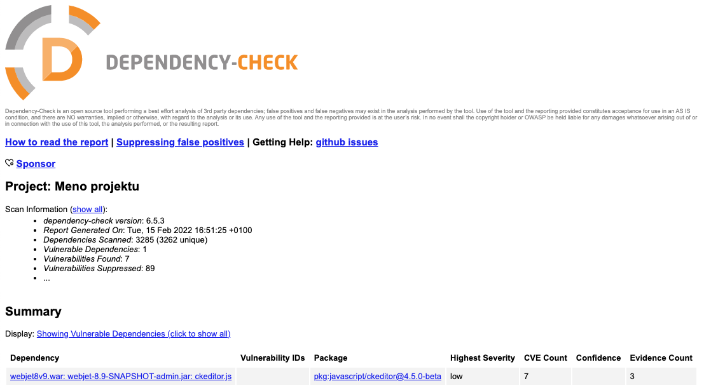

# Kontrola zraniteľností knižníc

Pomocou nástroja [OWASP Dependency-Check](https://jeremylong.github.io/DependencyCheck/index.html) môžete jednoducho kontrolovať zraniteľnosti v Java a JavaScript knižniciach web aplikácie. Tie odporúčame kontrolovať na pravidelnej báze.

Ak máte prístup k zdrojovému kódu/gradle projektu môžete spustiť analýzu priamo pomocou [gradlew príkazu](../../developer/backend/security.md#kontrola-zraniteľností-v-knižniciach).

Nástroj je ale možné spustiť aj nad vygenerovaným ```war``` archívom web aplikácie. Nainštalujte si verziu nástroja pre [príkazový riadok](https://jeremylong.github.io/DependencyCheck/dependency-check-cli/index.html).

Následne môžete spustiť kontrolu pomocou príkazu:

```sh
dependency-check --project "Meno projektu" --suppression dependency-check-suppressions.xml --suppression dependency-check-suppressions-project.xml --scan build/libs/*.war
```

parametrami sa nastavuje:

- ```--project``` - meno projektu, ktoré sa zobrazí v reporte.
- ```--suppression``` - cesta k [súborom s výnimkami](../../developer/backend/security.md#kontrola-zraniteľností-v-knižniciach), typicky je tento súbor súčasťou git repozitára.
- ```--scan``` - cesta k súboru/adresáru, ktorý sa má analyzovať.

Výsledkom je súbor ```dependency-check-report.html``` v aktuálnom adresári.

