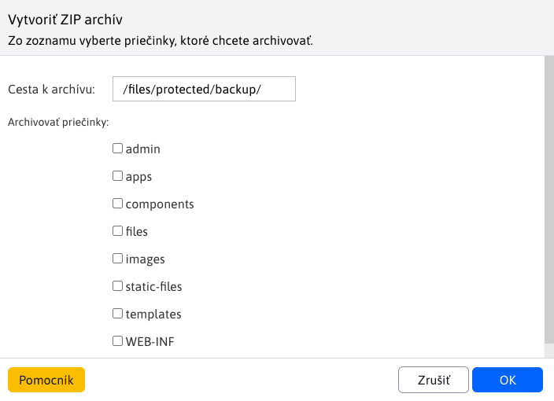

# Zálohovanie systému

Aplikácia slúži na vytvorenie ZIP archív jednotlivých priečinkov súborového systému WebJET. Môžete si zvoliť, ktoré priečinky sa do ZIP archívu majú zahrnúť a do ktorého priečinku sa má vytvoriť výsledný ZIP archív. Nevytvára sa záloha databázy, tú je potrebné vytvoriť nástrojmi na zálohovanie databáz.

!> **Upozornenie:** Objem dát v zvolených priečinkoch môže byť veľký a ZIP súbor sa nemusí vygenerovať správne (obmedzenie je na 2GB súbor). V prípade potreby môžete vytvárať zálohy po častiach (jednotlivých priečinkoch).

Tento proces môže trvať niekoľko desiatok minút podľa objemu dát v zvolených priečinkoch. Čakajte, kým celý proces skončí. Počas toho by sa vám v okne mala zobrazovať informácia o počte už vygenerovaných stránok a o celkovom počte stránok.

Výsledkom je zip archív vytvorený v zadanom priečinku.
