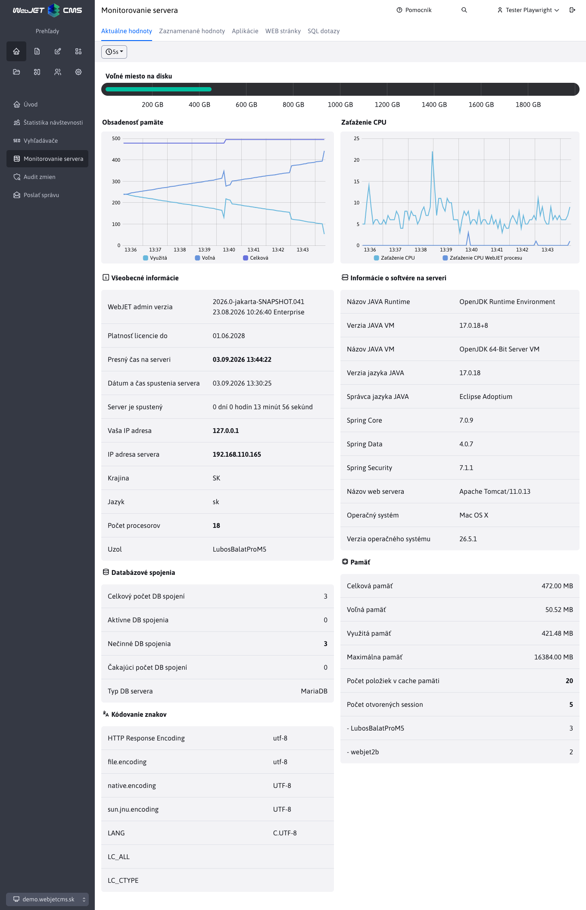
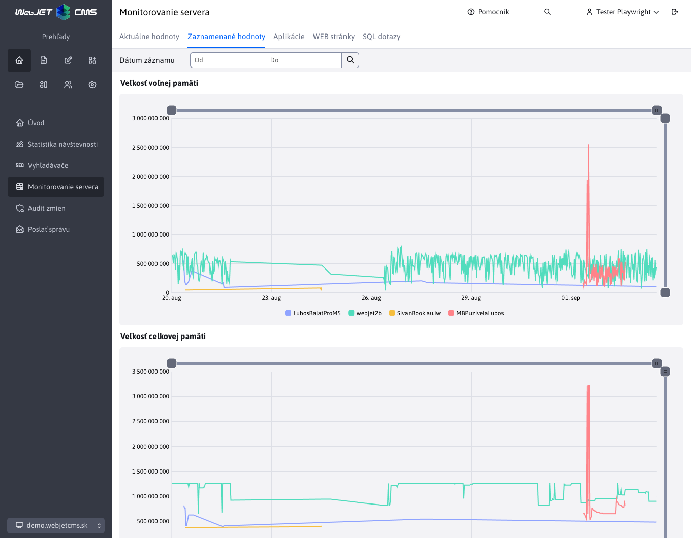

# Monitorovanie servera

## Vnútorné monitorovanie

Analýza výkonu a záťaže servera, jednotlivých aplikácií, databázových dotazov a samotných stránok je možné sledovať priamo v aplikácii Monitorovanie servera (v administrácii WebJETu v sekcii Prehľad).

Modul poskytuje nasledovné možnosti:

- **Aktuálne hodnoty** - aktuálne informácie o serveri a použitom softvéri, hodnoty zaťaženia servera, pamäte, počet databázových spojení a kódovanie znakov.



V hornej časti sa zobrazuje voľné miesto na disku a priebežne aktualizované grafy využitia pamäte a zaťaženia procesora. Interval aktualizácie údajov je možné zmeniť pomocou výberového poľa v nástrojovej lište.

### Všeobecné informácie

Sekcia obsahuje základné prevádzkové informácie o WebJET CMS a aplikačnom serveri. Zobrazuje verziu WebJET CMS, platnosť licencie, aktuálny čas, dátum spustenia a dobu behu servera, sieťové adresy, jazyk a krajinu servera, počet procesorov a názov aktuálneho uzla clustra.

### Informácie o softvéri na serveri

Sekcia sumarizuje verzie a názvy softvérových komponentov použitých na serveri. Obsahuje informácie o Java Runtime a JVM, verziu a dodávateľa Java, verzie Spring Core, Spring Data a Spring Security, názov aplikačného servera a názov a verziu operačného systému.

### Databázové spojenia

Sekcia zobrazuje aktuálny stav zásobníka databázových spojení. Uvádza celkový počet spojení a počty aktívnych, nečinných a čakajúcich spojení spolu s typom používaného databázového servera.

### Pamäť

Sekcia poskytuje prehľad o pamäti pridelenej JVM vrátane celkovej, voľnej, využitej a maximálnej pamäte. Zobrazuje tiež počet položiek v cache pamäti a počet otvorených používateľských session; v režime clustra sú session rozpísané aj podľa jednotlivých uzlov.

### Kódovanie znakov

V časti **Aktuálne hodnoty** sa zobrazuje sekcia **Kódovanie znakov** s nastavením HTTP odpovedí, JVM a locale prostredia bežiaceho procesu aplikačného servera. Zobrazené hodnoty pochádzajú priamo z procesu, v ktorom beží WebJET CMS, preto sa môžu líšiť od hodnôt v interaktívnom termináli používateľa.

Pre korektné spracovanie diakritiky v obsahu a názvoch súborov sa odporúčajú nasledujúce hodnoty:

| Hodnota | Význam | Odporúčaná hodnota |
| --- | --- | --- |
| `HTTP Response Encoding` | Kódovanie HTTP odpovedí nastavené vo WebJET CMS. | `utf-8` |
| `file.encoding` | Predvolené kódovanie JVM pre operácie, ktoré nemajú kódovanie určené explicitne. | `UTF-8` |
| `native.encoding` | Natívne kódovanie operačného systému zistené pri spustení JVM. | `UTF-8` |
| `sun.jnu.encoding` | Kódovanie používané JVM pri komunikácii s operačným systémom, napríklad pre názvy súborov. | `UTF-8` |
| `LANG` | Predvolené locale procesu aplikačného servera. | UTF-8 locale, napríklad `C.UTF-8` alebo `sk_SK.UTF-8` |
| `LC_ALL` | Voliteľné prepísanie locale pre všetky kategórie. | Prázdna hodnota alebo UTF-8 locale |
| `LC_CTYPE` | Voliteľné prepísanie locale pre spracovanie znakov. | Prázdna hodnota alebo UTF-8 locale |

Veľkosť písmen v označení kódovania nie je podstatná, hodnoty `utf-8` a `UTF-8` sú rovnocenné. Prázdne hodnoty `LC_ALL` a `LC_CTYPE` sú korektné, ak `LANG` obsahuje UTF-8 locale. Ak je niektorá z týchto premenných nastavená, nesmie prepisovať `LANG` locale hodnotou bez podpory UTF-8. Pri diagnostike názvov súborov je dôležitá najmä hodnota `sun.jnu.encoding`.

- **Zaznamenané hodnoty** - výpis historických zaznamenaných hodnôt využitia pamäte, ```sessions```, cache a spojení s databázou. Pre ukladanie historických hodnôt je potrebné nastaviť konf. premennú ```serverMonitoringEnable``` na hodnotu ```true```.



Po nastavení konfiguračnej premennej ```serverMonitoringEnablePerformance``` na ```true``` sú dostupné aj:

- **Aplikácie** - štatistika vykonaní jednotlivých aplikácií. Zobrazuje počet vykonaní, priemerný čas vykonania, počet vykonaní z cache pamäte a najpomalšie vykonanie.
- **WEB stránky** - štatistika zobrazení jednotlivých web stránok. Zobrazuje počet zobrazení, priemerný čas zobrazenia, najpomalšie a najrýchlejšie zobrazenie.

Po nastavení konfiguračnej premennej ```serverMonitoringEnableJPA``` na ```true``` je dostupné aj:

- **SQL dotazy** - štatistika rýchlosti vykonávania SQL dotazov. Zobrazuje počet vykonaní, priemerný čas vykonania, najpomalšie a najrýchlejšie vykonanie a samotný SQL dotaz.

!>**Upozornenie:** aktivácia monitorovania má vplyv na výkon servera a jeho pamäťové zaťaženie. Okrem možnosti zaznamenané hodnoty má zapnutie monitoringu dopad na výkon servera. Všetky údaje okrem časti zaznamenané hodnoty sú
držané len v pamäti servera, takže po jeho reštarte sa začnú evidovať nanovo.

!>**Upozornenie:** modulové možnosti **Aplikácie**, **WEB stránky** a **SQL dotazy** využívajú jedinečnú spoločnú logiku, ktorá je bližšie opísaná v [Monitorovanie servera podľa vybraného uzla](nodes-logic.md)

## Vzdialené monitorovanie behu servera

Ak potrebujete monitorovať stav WebJETu cez [Nagios](http://www.nagios.org)/[Zabbix](https://www.zabbix.com) alebo inú službu, WebJET poskytuje na URL adrese ```/components/server_monitoring/monitor.jsp``` svoj stav. Odpovedá HTTP **stavom 200 ak je všetko v poriadku**, alebo **stavom 500** (Internal Server Error) ak **nie sú splnené všetky kontroly**.

Uvedenú URL adresu je možné volať aj v sekundových intervaloch, odporúčame ju používať aj vrámci clustra pre monitorovanie dostupnosti jednotlivých nodov.

**Povolené IP adresy**, pre ktoré monitor.jsp korektne odpovedá sa nastavujú v konfiguračnej premennej ```serverMonitoringEnableIPs```.

Komponenta monitoruje nasledovné časti:

- **Inicializácia WebJETu**, vrátane jeho ```preheating``` (čakanie na inicializáciu cache objektov, alebo úloh na pozadí). Čas preheating sa nastavuje v konf. premennej monitoringPreheatTime (predvolene 0). WebJET odpovedá textom ```NOT INITIALISED``` ak nie je korektne inicializovaný (napr. nie je vôbec konektivita do databázy pri jeho štarte, alebo má neplatnú licenciu). Textom ```TOO SHORT AFTER START``` odpovedá počas preheating času (zaradenie do clustra by malo čakať na dokončenie načítania cache objektov/úloh na pozadí).
- Monitorovanie **dostupnosti databázového spojenia** - vykonáva sa SQL select z tabuľky `documents` (konkrétne ```SELECT title FROM documents WHERE doc_id=?```), pričom v konfiguračnej premennej ```monitorTestDocId``` je docid testovanej stránky. Ak sa SQL dotaz nepodarí odpovedá textom ```DEFAULT DOC NOT FOUND```.
- **Dostupnosť šablón** - ak je zoznam inicializovaných šablón menší ako 3 odpovedá textom ```NOT ENOUGHT TEMPLATES```.
- **Zápis údajov štatistiky** - overuje, že v zásobníku zápisu štatistík nie je podozrivo veľa záznamov (ich počet sa nastavuje v konfiguračnej premennej ```statBufferSuspicionThreshold```, predvolene 1000). Ak zásobník zápisu štatistík obsahuje väčšie množstvo údajov na zápis indikuje to buď problém s výkonom SQL servera, alebo problém s úlohami na pozadí. V prípade prekročenia počtu záznamov odpovedá textom ```STAT BUFFER SUSPICION```.
- Ak nastane **iná chyba** odpovedá textom ```EXCEPTION: xxxx```.

WebJET je možné aj manuálne **prepnúť do servisného režimu** nastavením konfiguračnej premennej ```monitorMaintenanceMode``` na true. Vtedy monitor.jsp odpovedá textom ```UNAVAILABLE```.

Ak je všetko v poriadku odpovedá textom ```OK```. Pre monitorovanie **postačuje  sledovať HTTP stav** odpovede, text je len informačný pre presnejšie určenie problému.

## Konfiguračné premenné

- ```serverMonitoringEnable``` - ak je nastavené na ```true```, spúšťa monitorovanie servera každých 30 sekúnd a zapisuje tieto hodnoty do tabuľky `monitoring`
- ```appendQueryStringWhenMonitoringDocuments``` - zachytávať pri monitorovaní aj SQL parametre `?`
- ```monitorTestDocId``` - ID stránky, ktorej databázové spojenie (získanie názvu) sa testuje v komponente `/components/server_monitoring/monitor.jsp` ktorú môže testovať dohľadový SW (predvolená hodnota: 1)
- ```serverMonitoringEnablePerformance``` - ak je nastavené na `true`, spúšťa monitorovanie rýchlosti SQL dotazov, web stránok a aplikácií (predvolená hodnota: false)
- ```serverMonitoringEnableJPA``` - ak je nastavené na `true`, spúšťa monitorovanie rýchlosti vykonávania SQL dotazov pre JPA, má ale za následok zvýšenie záťaže na pamäť servera (predvolená hodnota: false)
- ```serverMonitoringEnableIPs``` - Zoznam IP adries z ktorých je dostupná komponenta `monitor.jsp` pre monitorovanie servera (predvolená hodnota: 127.0.0.1,192.168.,10.,62.65.161.,85.248.107.,195.168.35.)
- ```monitoringPreheatTime``` - Počet sekúnd potrebných pre zahriatie web sídla (načítanie cache) po reštarte, počas ktorého bude `monitor.jsp` komponenta vracať nedostupnosť uzla clustra (predvolená hodnota: 0)
- ```monitoringEnableCountUsersOnAllNodes``` - Ak verejné uzle clustra nemajú možnosť zapisovať do tabuľky `_conf_/webjet_conf` nastavte na hodnotu `false`. Celkový počet `sessions` bude potom dostupný len súčtom z jednotlivých záznamov v monitorovaní servera.
