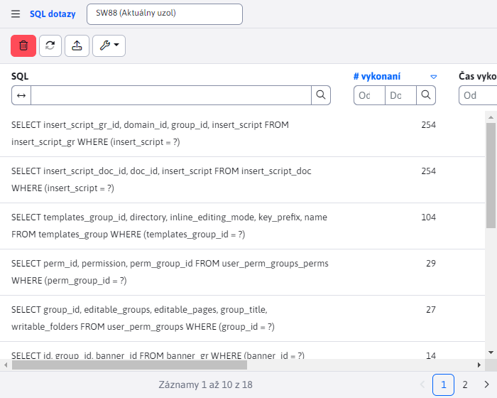
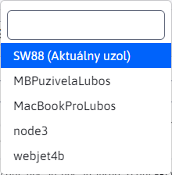
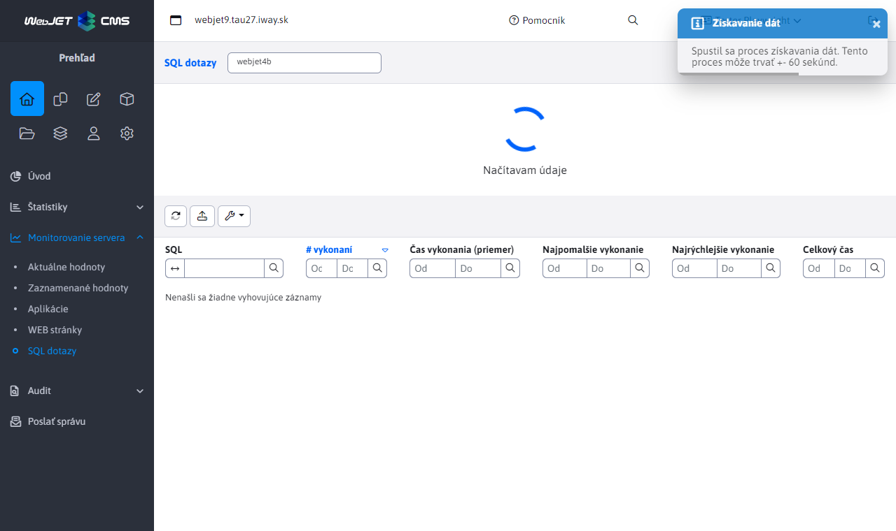

# Výmena údajov uzlov clustra

Stránky **Aplikácie**, **WEB stránky** a **SQL dotazy** zdieľajú rovnakú logiku ohľadne monitorovania servera podľa aktuálne zvoleného uzla. Na výber uzla slúži pole, ktorý sa nachádza v hlavičke stránky vedľa názvu stránky.



Po otvorení klikom, môžeme vidieť všetky dostupné možnosti. Prednastavená hodnota je vždy aktuálny uzol (uzol clustra na ktorý ste práve prihlásený), ktorý je označený textom ```(Aktuálny uzol)```.



Ak je zvolený uzol aktuálny, zobrazujú sa lokálne uložené dáta. V tomto prípade je taktiež k dispozícií aj tlačidlo vymazania, ktoré odstráni tieto lokálne uložené dáta (tlačidlo vymazania je dostupné iba v prípade aktuálneho uzla). V prípade iného ako aktuálneho uzla sa dáta získavajú z databázovej tabuľky.

## Obnovenie dát - aktuálny uzol

Ak je zvolený aktuálny uzol, tak po stlačení tlačidla obnovenia údajov sa iba získajú aktuálne uložené dáta (nepracuje sa tu s databázovými tabuľkami). Ak boli dáta predtým vymazané, môže chvíľu trvať kým sa tam objavia nové záznamy.

## Obnovenie dát - vzdialený uzol

V prípade iných uzlov, ako aktuálnych, je obnovenie dát zložitejšie. Dáta iných uzlov sú uložené v tabuľku ```cluster_monitoring```. Proces obnovenia dát začína vymazaním týchto dát z tabuľky, nakoľko už nemusia byť aktuálne.



Ako je vidieť na obrázku vyššie, dáta boli odstránené a zobrazí sa animácia čakajúca na dáta. Taktiež vidíme informačnú notifikáciu, ktorá nás upozorňuje, že tento proces môže trvať +- niekoľko sekúnd. Tento interval sa môže líšiť v závislosti od nastavenej konfiguračnej premennej ```clusterRefreshTimeout```.

Proces získania aktuálnych dát spočíva vo vytvorení požiadavky o aktuálne dáta pre nejaký uzol vytvorením záznamu v databázovej tabuľke ```cluster_refresher```. Samotný cluster v intervaloch zadaných konf. premennou ```clusterRefreshTimeout``` aktualizuje dáta v tabuľke ```cluster_monitoring``` pre konkrétny uzol, ak existuje pre tento uzol žiadosť v tabuľke  ```cluster_refresher```. Preto proces získavania dát môže trvať aj niekoľko minút a môže sa líšiť v závislosti od nastaveného intervalu obnovovania cluster-a (môže nastať aj situácia, kde cluster interval bol tesne pred obnovením a aktuálne dáta získame za 10 sekúnd, aj keď interval bol nastavený na 5 minút).

Síce to nie je zobrazené, ale stránka sa bude každých 10 sekúnd dopytovať, či do tabuľky ```cluster_monitoring``` neboli pridané nové dáta, ktoré by mohli byť zobrazené. V prípade, že požadovaný uzol neobsahoval žiadne dáta (ale tabuľka už bola aktualizovaná), vytvorí sa nová cluster požiadavka o dáta, a opäť budeme každých 10 sekúnd kontrolovať, či sa tieto dáta už aktualizovali. Celý proces sa bude opakovať dovtedy, kým aktualizovaná tabuľka ```cluster_monitoring``` nebude obsahovať aspoň jeden záznam k zobrazeniu. V tej chvíli sa skryje animácia a aktuálne získane dáta iného uzla sú zobrazené.