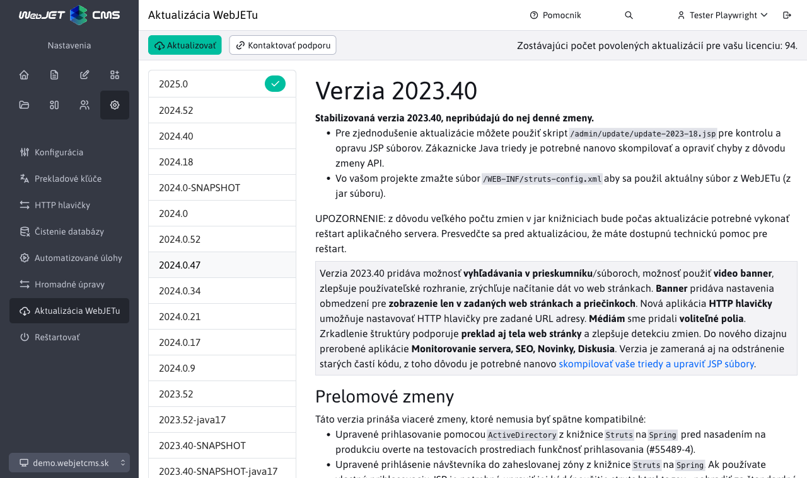
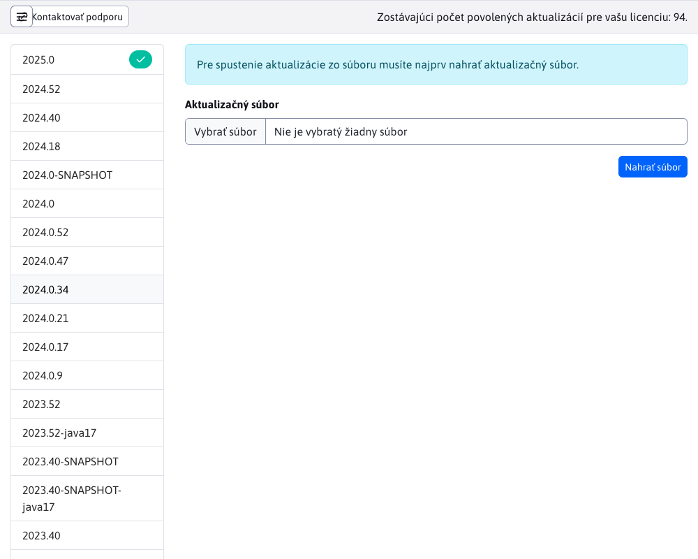

# Aktualizácia WebJETu

Sekcia Aktualizácia WebJETu slúži k aktualizácií verzií WebJETu. Ľavá časť obrazovky zobrazuje zoznam dostupných verzií WebJETu na ktoré sa dá Váš WebJET aktualizovať. Práve aktuálna verzia Vášho WebJETu je v zozname označená ikonou .

Pri kliknutí na jednotlivé verzie sa v pravej časti obrazovky zobrazí zoznam všetkých zmien, ktoré vybraná verzia prináša.

**Upozornenie:** aktualizáciu WebJETu vykonávajte len v prípade ak viete čo robíte. Pred aktualizáciou kontaktujte vášho poskytovateľa hostingu pre prípadnú podporu. Môže sa stať, že po aktualizácii WebJET nenaštartuje správne a bude nutný reštart servera.

Ak váš projekt obsahuje doplnkové JAR knižnice je potrebné ich umiestniť aj do priečinka `/WEB-INF/lib-custom/`. Počas aktualizácie je plne nahradený priečinok `/WEB-INF/lib/` a teda vaše knižnice by boli zmazané. To môže mať za následok neschopnosť spustenia po reštarte. Ak taká situácia nastane skopírujte chýbajúce knižnice do `/WEB-INF/lib/` zo zálohy.

## Aktualizácia na konkrétnu verziu

Pre aktualizovanie WebJETu na konkrétnu verziu je potrebné zvoliť želanú verziu a následne použiť tlačidlo pre spustenie aktualizácie 

## Aktualizovanie zo súboru

Podporovaná je taktiež možnosť využiť aktualizovanie zo súboru. Táto možnosť sa dá vybrať taktiež v ľavom menu ako .

Následne budete vyzvaný k výberu a následnému nahratiu súboru pomocou tlačidla . Ak bude súbor úspešne nahratý, budete vyzvaný k spusteniu samotnej aktualizácie pomocou tlačidla .

