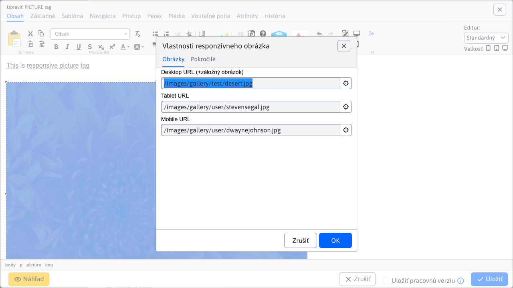

# Test prekladov

Cieľom tohto súboru je testovať prekladač a zachovanie formátovania. Tento súbor by mal obsahovať rôzne typy formátovania, ako sú **tučný text**, *kurzíva*, `kód`, a odkazy [Google](https://www.google.com).

Pre testovanie nastavte v súbore `deepmark.config.mjs` hodnotu `javascript` nasledovne:

```javascript
    directories: [
        ['sk/translation-test', '$langcode$/translation-test'],
    ]
```

Taktiež by mal obsahovať zoznamy, tu je dôležité, že za týmto nadpisom **zostane prázdny riadok**.

- Prvý bod
- Druhý bod
- Tretí bod

Dôležité je, aby zachoval štruktúru, prázdne riadky a podobne.

## `Sidebar` problém

Tu zmaže prázdny riadok za `point_left`, čo spôsobí, že sa tento odkaz spojí s ďalším textom. POZOR: otestujte správanie aj v `_sidebar.md` súbore, pretože tu to niekedy funguje správne.

POZOR: tiež na to, že spraví z `point_left` `point\_left`.

<div class="sidebar-section">Manuál pre prevádzku</div>

- [:point_left: Späť na Úvod](/?back)

- Bezpečnosť
  - [Bezpečnostné testy](../sysadmin/pentests/README.md)
  - [Kontrola zraniteľností knižníc](../sysadmin/dependency-check/README.md)
  - [Aktualizácia WebJETu](../sysadmin/update/README.md)

## Tabuľky

Ukážka tabuľky. Tu POZOR na to, aby nespravil z `perex_group_id` `perex\_group\_id` a podobne.

| perex_group_id | perex_group_name      | `domain_id` | `available_groups` |
|----------------|-----------------------|-------------|--------------------|
| 3              | ďalšia perex skupina  | 1           | test               |
| 645            | `deletedPerexGroup`   | 1           | `NULL`             |
| 794            | kalendár-udalostí     | 1           |                    |
| 1438           | ďalšia perex skupina  | 83          | pekný deň          |
| 1439           | `deletedPerexGroup`   | 83          | `NULL`             |
| 1440           | kalendár-udalostí     | 83          | `NULL`             |

Tabuľka s medzerami v hlavičke:

| Kód modulu | Popis | Dôvod deaktivácie |
| --- | --- | --- |
| `cmp_forum` | Fórum a diskusné fórum | Znižuje riziko XSS a spam útokov |
| `cmp_blog` | Blog | Znižuje riziko XSS a spam útokov |
| `cmp_dmail` | Distribučný zoznam (newsletter) | Znižuje riziko spam útokov cez hromadné rozosielanie |

## HTML kód

V MD súbore môže byť aj HTML kód, napríklad YouTube video. Tu nesmie zabudnúť na úvodzovky za `allow` atribútom.

<div class="video-container">
    <iframe width="560" height="315" src="https://www.youtube.com/embed/XRnwipQ-mH4" title="YouTube video player" frameborder="0" allow="accelerometer; autoplay; clipboard-write; encrypted-media; gyroscope; picture-in-picture" allowfullscreen></iframe>
</div>

## Changelog

V changelogu máme rôzne podivné konštrukcie.

- Upravené spracovanie **nahrávania súborov** `multipart/form-data`, viac v [sekcii pre programátora](#test-prekladov) (#57793-3).
- Odporúčame **skontrolovať funkčnosť všetkých formulárov** z dôvodu úprav ich spracovania, viac informácií v sekcii [pre programátora](#test-prekladov) (#58161).

### Webové stránky

- Pridaná možnosť vkladať `PICTURE` element, ktorý zobrazuje [obrázok podľa rozlíšenia obrazovky](../frontend/setup/ckeditor.md#picture-element) návštevníka. Môžete teda zobraziť rozdielne obrázky na mobilnom telefóne, tablete alebo počítači (#58141).



- Pridaná možnosť vkladať [vlastné ikony](../frontend/setup/ckeditor.md#svg-ikony) definované v spoločnom SVG súbore (#58181).


### Rôzne formátovania

Tu je tučný text **tučný**, kurzíva *kurzíva*, ale aj ich kombinácia ***tučná kurzíva***. Ďalej je tu ~~prečiarknutý text~~ a text s `inline kódom`.

Odkaz s názvom (title): [Google](https://www.google.com "Vyhľadávač Google").

Referenčný odkaz: [WebJET CMS][webjet] a ďalší [odkaz][webjet].

[webjet]: https://www.webjetcms.sk "WebJET CMS"

## Nadpisy všetkých úrovní

### H3 nadpis sekcie

#### H4 nadpis pod-sekcie

##### H5 nadpis

###### H6 nadpis

## Citácie

Jednoduchá citácia:

> Toto je citácia. Môže obsahovať **tučný text**, *kurzívu* alebo `kód`.

Vnorená citácia:

> Vonkajšia citácia s nejakým textom.
>
> > Vnorená citácia dovnútra.
> >
> > > Ešte hlbšia citácia.

Citácia s viacerými odstavcami:

> Prvý odsek citácie obsahuje text, ktorý môže byť dlhší.
>
> Druhý odsek tej istej citácie.

## Upozornenia (Alerts/Admonitions)

!> Toto je varovanie (warning). Obsahuje dôležitú informáciu na ktorú si treba dať pozor.

?> Toto je tip (info). Obsahuje užitočnú informáciu pre používateľa.

## Usporiadané zoznamy

1. Prvý bod
2. Druhý bod
3. Tretí bod
   1. Vnorený prvý bod
   2. Vnorený druhý bod
4. Štvrtý bod

Zoznam s dlhším textom:

1. **Prvý bod** – obsahuje tučný text a popis čo sa stane pri tejto voľbe.
2. *Druhý bod* – obsahuje kurzívu a ďalší popis.
3. Tretí bod s odkazom na [dokumentáciu](https://www.google.com).

## Neusporiadané zoznamy – vnorené

- Hlavný bod A
  - Vnorený bod A1
  - Vnorený bod A2
    - Hlboko vnorený bod A2a
    - Hlboko vnorený bod A2b
  - Vnorený bod A3
- Hlavný bod B
- Hlavný bod C

## Zoznam úloh (Task list)

- [x] Dokončená úloha
- [x] Ďalšia dokončená úloha
- [ ] Nedokončená úloha
- [ ] Ďalšia nedokončená úloha s **tučným** textom

## Horizontálna čiara

Text pred horizontálnou čiarou.

---

Text za horizontálnou čiarou.

## Kódové bloky

Blok s jazykom SQL:

```sql
SELECT wp.doc_id, wp.title, wp.perex_group_id
FROM web_pages wp
WHERE wp.domain_id = 1
  AND wp.deleted = 0
ORDER BY wp.doc_id;
```

Blok s jazykom Java:

```java
@RestController
@RequestMapping("/api/v1/pages")
public class PageRestController {
    @GetMapping("/{id}")
    public ResponseEntity<PageBean> getPage(@PathVariable Long id) {
        return ResponseEntity.ok(pageService.getPage(id));
    }
}
```

Blok s jazykom `Bash`:

```bash
./gradlew appStart -Pprofile=local
```

Blok s jazykom YAML:

```yaml
spring:
  datasource:
    url: jdbc:mariadb://localhost:3306/webjet
    username: webjet
    password: webjet
```

## Pevný riadkový zlom (Hard line break)

Toto je prvý riadok.\
Toto je druhý riadok po pevnom zlome.

Toto je prvý riadok s dvoma medzerami na konci (hard break pred ním).
Toto je druhý riadok po soft-break.

## Únikové znaky (Escaped characters)

Tieto znaky musia zostať neporušené po preklade: \*hviezdička\*, \_podčiarkovník\_, \`spätný apostrof\`, \[hranatá zátvorka\], \#mriežka, spätný apostrof \`, \&ampersand\.

## Obrázky

Obrázok s alt textom:


Obrázok s alt textom a `title`:


Referenčný obrázok:

![Logo][logo]

[logo]: ../frontend/setup/picture-element.png "Logo WebJET"

## Zmiešané formátovanie v texte

Toto je odsek s **tučným**, *kurzívnym* a ***tučno-kurzívnym*** textom. Obsahuje aj `inline kód`, ~~prečiarknutý text~~ a [odkaz na Google](https://www.google.com). Tiež môže obsahovať URL adresu: https://www.webjetcms.sk.

Ďalší odsek s kombináciou formátovania vo vete: Pri nastavovaní hodnoty `domain_id` v tabuľke `web_pages` je potrebné použiť správnu hodnotu **pred uložením záznamu**, inak môže dôjsť k chybe.

## Tabuľka s rôznym formátovaním v bunkách

| Stĺpec | Tučný text | Kód | Odkaz |
| -------- | ----------- | ----- | ------- |
| Riadok 1 | **tučný** | `kód_hodnota` | [odkaz](https://www.google.com) |
| Riadok 2 | *kurzíva* | `NULL` | [Dokumentácia](../frontend/setup/ckeditor.md) |
| Riadok 3 | ~~prečiarknuté~~ | `perex_group_id` | – |

Tabuľka so zarovnaním stĺpcov:

| Ľavý stĺpec | Stredný stĺpec | Pravý stĺpec |
|:------------|:--------------:|-------------:|
| vľavo       | stred          | vpravo       |
| hodnota A   | hodnota B      | hodnota C    |

## Inline HTML

Text s inline HTML: toto je <strong>tučný HTML text</strong> a toto je <em>HTML kurzíva</em>.

Inline <code>HTML kód</code> a <a href="https://www.google.com">HTML odkaz</a>.

<p>Odstavec v HTML značke s <strong>tučným</strong> textom a <a href="https://www.google.com" title="Google">odkazom</a>.</p>

## Viacriadkové zoznamy s odsekmi

- Prvý bod zoznamu.

    Tento odsek patrí k prvému bodu zoznamu a je odsadený.

- Druhý bod zoznamu.

    Tento odsek patrí k druhému bodu zoznamu.

    > Citácia vnorená do bodu zoznamu.

- Tretí bod zoznamu s kódom:

    ```javascript
    const value = config.get('domain_id');
    ```
